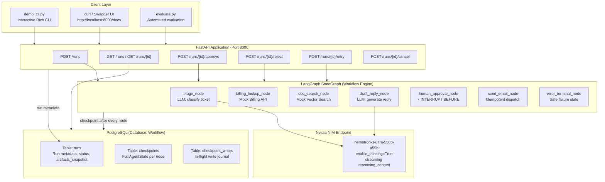
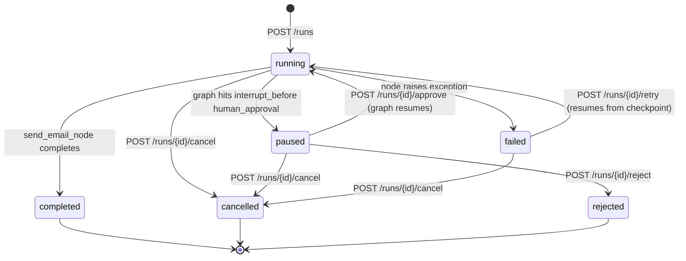
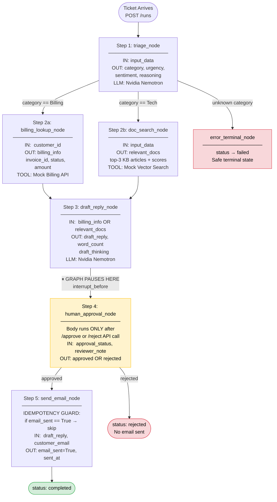
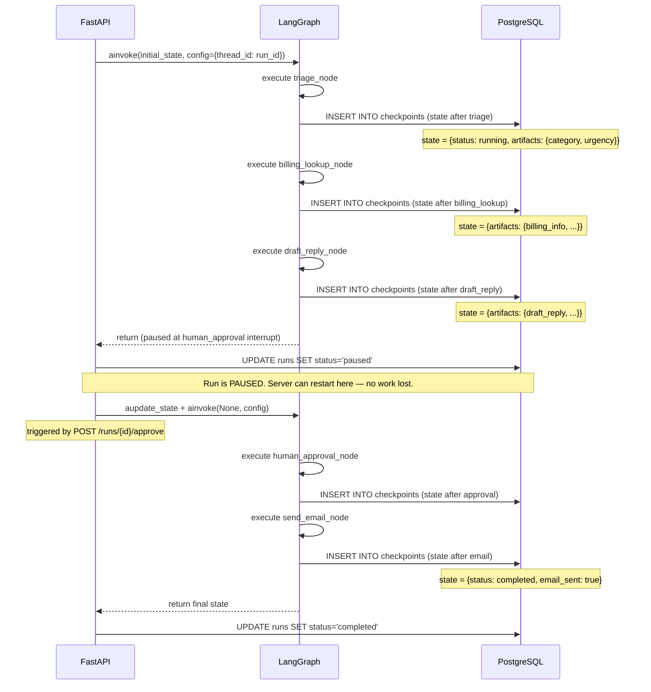
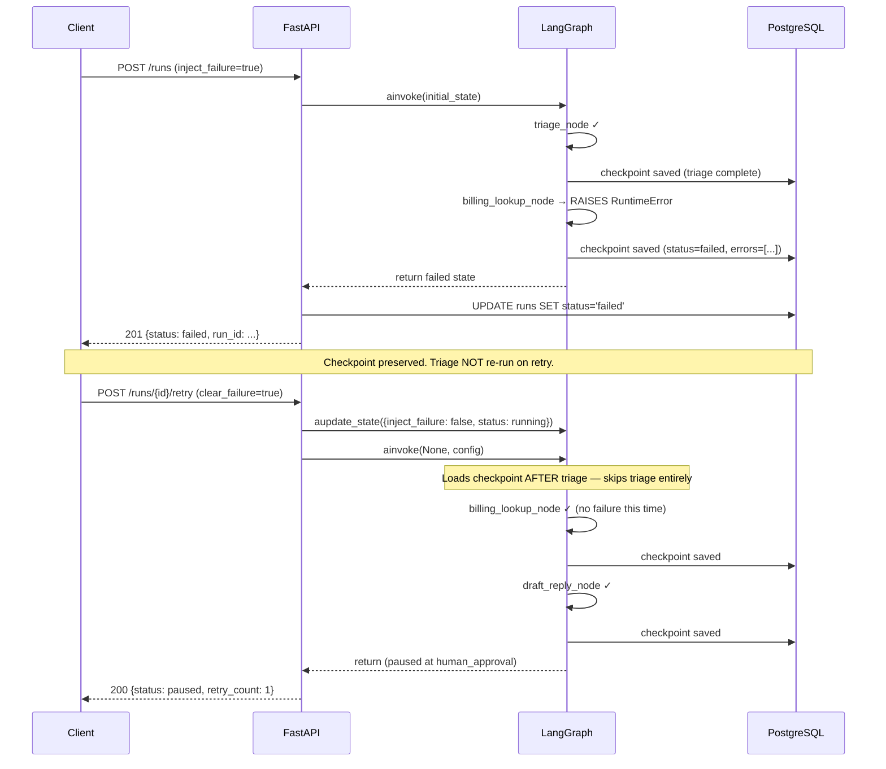
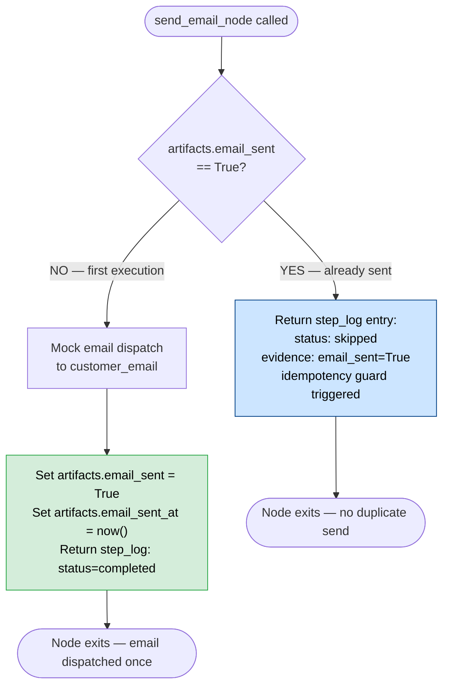
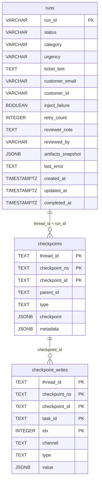

# Architecture — Durable Workflow Orchestrator

## Design Philosophy

The system is built around three principles :

1. **State is the source of truth.** Every piece of information  — inputs, outputs, errors, decisions — lives in `AgentState`. No side-channel variables, no global state.
2. **The graph is append-only.** Nodes only add to `step_log` and `artifacts`. They never delete or overwrite existing data. This makes every run fully auditable.
3. **Persistence is structural, not bolted on.** PostgreSQL checkpoints are wired into the graph at construction time via `AsyncPostgresSaver`. The application code never manually saves state.

---

## System Architecture Diagram



---

## Workflow State Machine



---

## Node Execution Flow



---

## Checkpoint Persistence Flow



---

## Failure and Retry Flow



---

## Idempotency Guard



---

## Database Schema



> `runs` is managed by SQLAlchemy ORM (asyncpg driver). `checkpoints` and `checkpoint_writes` are managed by LangGraph's `AsyncPostgresSaver` (psycopg3 driver). Both point to the same PostgreSQL database.

---

## Component Breakdown

### 1. LangGraph Graph Engine

LangGraph models workflows as a directed graph:

- **Nodes** — Python async functions receiving `AgentState`, returning a partial update dict
- **Edges** — connect nodes; conditional edges use a routing function to pick the next node at runtime
- **Checkpointer** — intercepts every node completion and persists the full state snapshot

#### LLM — Nvidia Nemotron via NIM

Uses `nvidia/nemotron-3-ultra-550b-a55b` via Nvidia's [NIM inference platform](https://build.nvidia.com/). Uses the raw `openai` SDK (not LangChain) to capture `reasoning_content` from the streaming response:

```python
from openai import OpenAI

client = OpenAI(
    base_url="https://integrate.api.nvidia.com/v1",
    api_key=settings.nvidia_api_key,
)

stream = client.chat.completions.create(
    model="nvidia/nemotron-3-ultra-550b-a55b",
    messages=[...],
    temperature=0.6,
    extra_body={"chat_template_kwargs": {"enable_thinking": True}},
    stream=True,
)

for chunk in stream:
    reasoning = getattr(chunk.choices[0].delta, "reasoning_content", None)
    content   = getattr(chunk.choices[0].delta, "content", None)
```

Two temperature profiles:
- `temperature=0.3` for triage — deterministic classification
- `temperature=0.7` for draft reply — varied, human-sounding responses

#### Why raw `openai` SDK, not LangChain `ChatOpenAI`

LangChain's `ChatOpenAI` silently drops `reasoning_content` from the stream delta — it only surfaces the `content` field. The `nemotron-3-ultra-550b-a55b` model returns its internal reasoning in `reasoning_content` when `enable_thinking=True`. Using the raw SDK is the only way to capture the full thinking trace.

---

### 2. Persistence Layer — PostgreSQL+SQLAlchemy

#### Two distinct storage concernsn

| Store | Technology | Purpose |
|---|---|---|
| **LangGraph checkpoints** | `AsyncPostgresSaver` (psycopg3) | Serialised `AgentState` snapshots after every node |
| **Run metadata** | SQLAlchemy ORM (asyncpg) | Fast lookup of run_id → status without deserialising checkpoints |

#### Why two drivers

- `asyncpg` — fastest async PostgreSQL driver; used by SQLAlchemy for ORM queries (`SELECT runs WHERE run_id = $1`)
- `psycopg3` — LangGraph's `AsyncPostgresSaver` hard-requires a `psycopg.AsyncConnection`; not compatible with asyncpg

Both point to the same database, managed as independent connection pools.

#### `AsyncPostgresSaver` setup

```python
import psycopg
from langgraph.checkpoint.postgres.aio import AsyncPostgresSaver

connection = await psycopg.AsyncConnection.connect(
    settings.checkpoint_db_uri,
    autocommit=True,
)
checkpointer = AsyncPostgresSaver(connection)
await checkpointer.setup()  # creates checkpoints + checkpoint_writes tables
```

---

### 3. FastAPI API Layer

All endpoints are `async def`. The graph and DB session are dependency-injected.

**Status detection after `ainvoke()`:**

LangGraph returns `status: "running"` when the graph pauses at `interrupt_before` — because the thread is still "in progress" from the graph's perspective. The API layer detects a true pause by inspecting `artifacts` directly:

```python
if artifacts.get("email_sent") is True:
    current_status = "completed"
elif artifacts.get("draft_reply"):
    current_status = "paused"   # graph paused at human_approval
else:
    current_status = graph_status  # running or failed
```

---

### 4. Node Contract

Every node follows this contract:

```python
async def step_name(state: AgentState) -> dict:
    started = _now_iso()
    try:
        # ... do work ...
        ended = _now_iso()
        return {
            "artifacts": {**state["artifacts"], "new_key": value},
            "step_log":  state["step_log"] + [_log_entry(step, "completed", started, ended, evidence)],
            "errors":    state["errors"],
        }
    except Exception as exc:
        ended = _now_iso()
        return {
            "status":   "failed",
            "step_log": state["step_log"] + [_log_entry(step, "failed", started, ended, {"error": str(exc)})],
            "errors":   state["errors"] + [{"step": step, "error": str(exc), "timestamp": ended}],
            "artifacts": state["artifacts"],
        }
```

---

### 5. Idempotency Strategy

**Level 1 — State flag guard (Step 5)**

`send_email_node` checks `artifacts["email_sent"] == True` before dispatching. If True, returns a `"skipped"` log entry and exits. Safe to call any number of times.

**Level 2 — LangGraph checkpoint replay**

Completed nodes are never re-entered on retry. The graph resumes *after* the last completed checkpoint. Steps 1–4 are inherently idempotent at the orchestration level.

---

### 6. Key Design Decisions

| Decision | Rationale |
|---|---|
| `interrupt_before` vs manual pause flag | Atomic with checkpointing — no race condition between flag write and next node starting |
| Separate `runs` table vs checkpoints only | Checkpoint deserialization is expensive for list queries; `runs` table is a cheap index |
| Mock tools return realistic data structures | Swapping for real APIs requires only changing the tool module — node logic unchanged |
| `inject_failure` stored in AgentState | Persisted in checkpoint — failure scenario is reproducible and resumable across restarts |
| Append-only `artifacts` and `step_log` | Full audit trail; every state transition is visible; simplifies checkpoint diffing |
